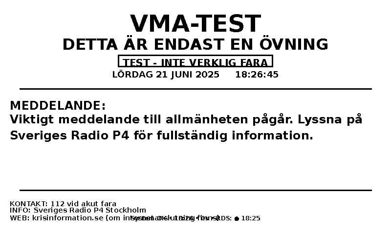
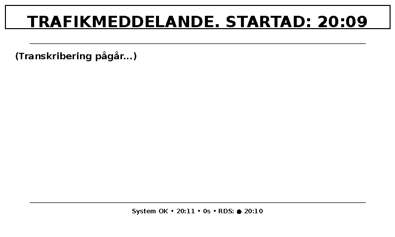
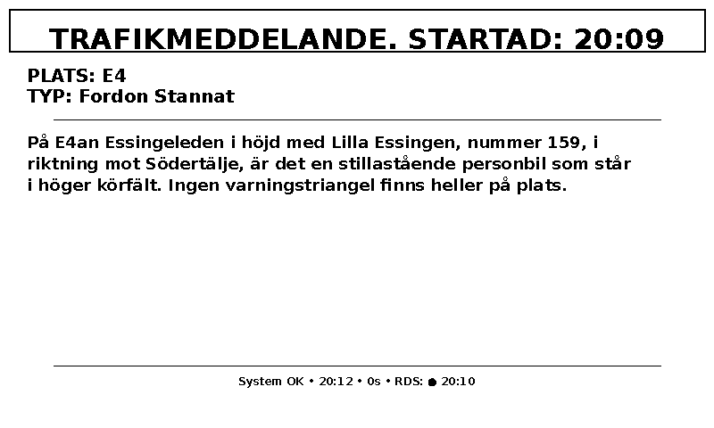
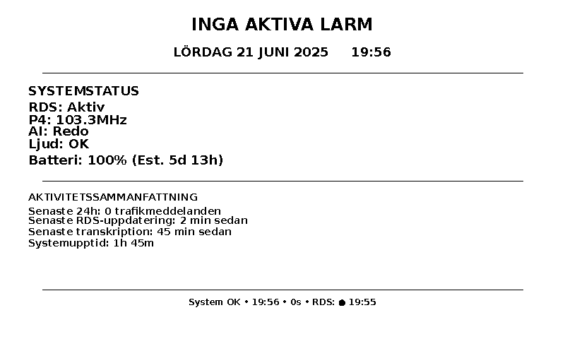

# VMA Emergency Broadcast Detection System

**Offline-system för detektering, inspelning och transkribering av VMA (Viktiga Meddelanden till Allmänheten) från svensk FM-radio**

**Status: Produktionsklar system med automatisk start**

---

## Vad är detta system

Detta system övervakar automatiskt Sveriges Radio P4 för att fånga upp nödutssändningar (VMA - Viktigt Meddelande till Allmänheten) och trafikmeddelanden. Det använder FM-radio och RDS-signaler (Radio Data System) för att upptäcka när viktiga meddelanden sänds, spelar sedan in ljudet och transkriberar det med hjälp av AI.

**Kritisk fördel: Ingen internet- eller mobilanslutning krävs.** Systemet fungerar helt offline och använder endast FM-radiomottagning. Detta gör det ovärderligt under kriser när internet och mobilnät kan vara opålitliga eller helt otillgängliga. Så länge du har adekvat FM-radiomottagning kommer systemet att fortsätta övervaka för nödutssändningar.

Systemet är designat för döva och hörselskadade som behöver tillgång till kritisk säkerhetsinformation under kriser, men är användbart för alla som vill ha pålitlig krisinformation oberoende av internetinfrastruktur.

### Viktiga funktioner

- **Automatisk detektering av VMA-nödutssändningar** (PTY-koder 30/31)
- **Realtidsinspelning och svensk AI-transkribering**
- **Visuell display på e-paper-skärm** med automatisk prioritetsväxling
- **Extremt låg strömförbrukning** för batteridrift
- **Sessionssäkerhetskopieringssystem** säkerställer att ingen data förloras
- **Automatisk start och självunderhåll**
- **RDS-mottagningsindikator** för döva användare - visar om systemet tar emot RDS-data
- **Fungerar helt offline** - behöver endast FM-radiomottagning

### Designat för svenska förhållanden

- Övervakar Sveriges Radio P4 (103,3 MHz Stockholm)
- Använder KBWhisper AI-modell optimerad för svenska språket
- Följer svenska standarder för nödutssändningar
- Kan anpassas för andra länder med liknande RDS-system

---

## Skärmdumpar från systemet

### Testmeddelande av VMA


*VMA-meddelanden får högsta prioritet och visas omedelbart när de detekteras. Systemet visar tydligt att det är ett testmeddelande.*

### Visar när transkribering pågår


*När ett trafikmeddelande detekteras börjar systemet spela in och visa "(Transkribering pågår...)" tills AI:n är klar.*

### Färdig transkribering visas


*När transkriberingen är klar visas den fullständiga texten med nyckelinformation som plats, typ av händelse och riktning.*

### Statuskärm när inga aktiva larm eller meddelanden visas


*Normal driftskärm som visar systemstatus, batterinivå, senaste aktivitet och kritiskt - RDS-mottagningsindikator (RDS: ● 19:55) som bekräftar att systemet tar emot signaler.*

---

## Enkel installationsguide

**Denna guide har testats på Raspberry Pi 5 8GB RAM. Alla kommandon kan kopieras direkt i terminalen.**

### Steg 1: Förbered operativsystemet

**Installera Raspberry Pi OS (Bullseye eller senare) på din Pi 5**

```bash
# Aktivera SPI för e-paper-displayen
sudo raspi-config
```
Välj: Interface Options → SPI → Enable → Finish

```bash
# Uppdatera systempaket
sudo apt update
sudo apt upgrade -y

# Installera nödvändiga systempaket
sudo apt install -y git python3 python3-pip python3-venv cmake build-essential libusb-1.0-0-dev pkg-config meson ninja-build sox alsa-utils
```

### Steg 2: Installera RTL-SDR Blog V4-drivrutiner

**Kritiskt: Måste använda RTL-SDR Blog-drivrutiner, inte standard rtl-sdr**

```bash
cd ~
git clone https://github.com/rtlsdrblog/rtl-sdr-blog
cd rtl-sdr-blog
mkdir build
cd build
cmake ../ -DINSTALL_UDEV_RULES=ON
make
sudo make install
sudo ldconfig
```

**Verifiera RTL-SDR-installation:**
```bash
rtl_test -t
```
**Förväntad utdata:** "RTL-SDR Blog V4 Detected"

### Steg 3: Installera Redsea RDS-avkodare

```bash
cd ~
git clone https://github.com/windytan/redsea
cd redsea
meson setup build
cd build
meson compile
```

**Verifiera Redsea-installation:**
```bash
./redsea --help
```
**Förväntad utdata:** Hjälptext utan fel

### Steg 4: Installera e-paper-displaybibliotek

```bash
cd ~
git clone https://github.com/waveshare/e-Paper.git
cd e-Paper/RaspberryPi_JetsonNano/python/lib
sudo cp -r waveshare_epd /usr/local/lib/python3.11/dist-packages/
sudo chmod -R 755 /usr/local/lib/python3.11/dist-packages/waveshare_epd
```

**Verifiera e-paper-bibliotek:**
```bash
python3 -c "from waveshare_epd import epd4in26; print('✅ E-paper-bibliotek OK')"
```

### Steg 5: Konfigurera AI-miljö (KRITISKT STEG)

**Detta steg är väsentligt för transkriberingsfunktionalitet**

```bash
# Skapa Python virtuell miljö för AI
python3 -m venv ~/vma_env

# Aktivera AI-miljön
source ~/vma_env/bin/activate

# Installera PyTorch (tar 5-10 minuter)
pip install torch torchaudio --index-url https://download.pytorch.org/whl/cpu

# Installera AI-beroenden (tar 3-5 minuter)
pip install transformers datasets tokenizers

# Avaktivera miljön när testet är klart
deactivate
```

**Testa AI-installation:**
```bash
# Testa PyTorch
source ~/vma_env/bin/activate
python -c "
import torch
print(f'✅ PyTorch version: {torch.__version__}')
print('✅ AI-transcription redo!')
"
deactivate
```

### Steg 6: Ladda ner och konfigurera VMA-systemet

```bash
cd ~
# Ladda ner/kopiera alla VMA-systemfiler till ~/rds_logger3/
# (Filer ska tillhandahållas separat)

cd ~/rds_logger3
chmod +x *.sh
```

**Konfigurera för din plats:**
```bash
nano config.py
```

**Viktiga inställningar att kontrollera/ändra:**
```python
# Din lokala P4-frekvens (se frekvenstabellen nedan)
FREQUENCY = 103300000    # Standard: Stockholm 103,3 MHz

# RTL-SDR-mottagningsparametrar
GAIN = 30                # Börja med 30, justera baserat på signalkvalitet
PPM_CORRECTION = 50      # Frekvenskorrigering för din RTL-SDR

# Sökväg till redsea (uppdatera om installerad någon annanstans)
REDSEA_PATH = "/home/chris/redsea/build/redsea"
```

### Steg 7: Testa systemkomponenter

**Testa FM-mottagning:**
```bash
cd ~/rds_logger3

# Testa RTL-SDR med din antenn
rtl_test -t
```

**Testa FM-ljudmottagning:**
```bash
rtl_fm -f 103.3M -s 200000 -g 30 - | aplay -r 22050 -f S16_LE
```
**För hörande:** Du bör höra tydligt P4-ljud. Tryck Ctrl+C för att stoppa.

**För döva/hörselskadade:** Öppna en ny terminal och kör detta kommando för att visuellt kontrollera att RDS-data tas emot:
```bash
# I ny terminal - visar RDS-data visuellt
rtl_fm -f 103.3M -s 171000 -g 30 - | ~/redsea/build/redsea -r 171000
```
Du ska se RDS-data rulla förbi med "PS", "RT" och andra fält. Om inget visas, justera antennen och prova igen. Tryck Ctrl+C för att stoppa båda kommandona.

**Testa displayssystemet:**
```bash
python3 test_display_functionality.py
```
Förväntad utdata: "9/9 tests PASSED"

**Testa komplett system:**
```bash
./start_vma_with_display.sh
```
Systemet ska starta utan fel. Tryck Ctrl+C för att stoppa.

### Steg 8: Konfigurera automatisk start

```bash
cd ~/rds_logger3

# Installera systemd-tjänst
sudo cp vma-system.service /etc/systemd/system/
sudo systemctl daemon-reload
sudo systemctl enable vma-system.service

# Testa automatisk start
sudo systemctl start vma-system.service
sudo systemctl status vma-system.service
```

### Steg 9: Slutlig verifiering

**Kontrollera systemstatus:**
```bash
sudo systemctl status vma-system.service
```
Förväntad utdata: "Active: active (running)"

**Kontrollera RDS-mottagning:**
```bash
tail -f logs/rds_continuous_$(date +%Y%m%d).log
```
Du bör se regelbundna RDS-datauppdateringar.

E-paper-displayen ska visa aktuell systemstatus och indikera "RDS: ●" som bekräftar att systemet tar emot RDS-data.

---

## Hårdvarukrav

### Nödvändiga komponenter

**System testat på: Raspberry Pi 5 8GB RAM med Raspberry Pi OS**

| Komponent | Rekommenderad modell | Pris (SEK) | Anteckningar |
|-----------|---------------------|-------------|--------------|
| **Dator** | Raspberry Pi 5 (8GB RAM) | 1200 | Verifierad fungerande konfiguration |
| **SDR-radio** | RTL-SDR Blog V4 | 400 | Kräver speciella drivrutiner |
| **Ljudgränssnitt** | Jabra EVOLVE 30 II USB-headset | 800 | USB-ljudenhet behövs |
| **Display** | Waveshare 4.26" E-Paper HAT | 600 | 800x480 pixlar |
| **Antenn** | Teleskopantenn (SMA-anslutning) | 100 | För FM-mottagning |
| **Lagring** | MicroSD 64GB+ (Class 10) | 200 | Höghastighetskort krävs |

**Total kostnad: ~3300 SEK**

### Kritiska hårdvaruanteckningar

**RTL-SDR Blog V4:**
- Måste använda drivrutiner från rtlsdrblog/rtl-sdr-blog repository
- Standard rtl-sdr-drivrutiner fungerar INTE
- Verifierat fungerande vid 171kHz-samplingsfrekvens

**E-paper-display:**
- Kräver SPI-gränssnitt aktiverat på Raspberry Pi
- Använder minimal ström (0W standby, 1W under uppdateringar)
- Uppdateringar tar ~4 sekunder (normalt för e-paper-teknik)

---

## Mottagningsinställning och optimering

### P4-frekvenser per region

**Större svenska städer och deras P4-frekvenser:**
- Stockholm: 103,3 MHz (standard i config.py)
- Göteborg: 104,7 MHz
- Malmö: 101,8 MHz
- Uppsala: 105,0 MHz
- Västerås: 102,8 MHz
- Örebro: 105,5 MHz
- Norrköping: 106,1 MHz
- Helsingborg: 104,3 MHz
- Jönköping: 105,9 MHz
- Umeå: 102,1 MHz

**Hitta din lokala P4-frekvens på:** sverigesradio.se/sida/artikel.aspx?programid=2054&artikel=5465699

### RTL-SDR-konfigurationsparametrar

**Nyckelinställningar i config.py:**
```python
FREQUENCY = 103300000    # Din lokala P4-frekvens i Hz
SAMPLE_RATE = 171000     # 171kHz - optimal för RDS-avkodning
GAIN = 30                # 30dB - justera baserat på signalstyrka
PPM_CORRECTION = 50      # Frekvenskorrigering - justera för din enhet
```

### RDS-mottagningsindikator

**Systemet visar RDS-status för döva användare:**
- **● Aktiv mottagning** - RDS-data tagen emot inom 5 minuter
- **○ Svag mottagning** - RDS-data 5-15 minuter gammal
- **✕ Ingen mottagning** - Ingen RDS-data på över 15 minuter

Denna indikator är kritisk för döva användare som inte kan kontrollera mottagning genom att lyssna med hörlurar.

---

## Projektfilstruktur

```
~/rds_logger3/
├── start_vma_with_display.sh    # Huvudstartskript - startar hela systemet
├── start_vma_system.sh          # Kärn-VMA-system utan display
├── vma-system.service           # Systemd-servicefil för automatisk start
├── config.py                   # Central konfiguration (frekvens, sökvägar, etc.)
├── rds_logger.py               # Huvudapplikation - bearbetar all RDS-data
├── rds_detector.py             # Detekterar VMA- och trafikhändelser från RDS
├── rds_parser.py               # Tolkar JSON RDS-data från redsea
├── audio_recorder.py           # Spelar in ljud när händelser detekteras
├── transcriber.py              # AI-transkribering med KBWhisper
├── display_monitor.py          # Övervakar loggar och uppdaterar display
├── display_manager.py          # Hanterar displayinnehåll och uppdateringar
├── display_state_machine.py    # Hanterar displaylägesväxling
├── content_formatter.py        # Formaterar innehåll för display
├── screen_layouts.py           # Skapar visuella layouter för e-paper
├── display_config.py           # Displaykonfiguration och inställningar
├── cleanup.py                  # Automatisk rensning och underhåll
├── test_display_functionality.py # Testsvit för displaysystem
├── test_display_live.py        # Live displaydemonstration
├── vma_simulator.py            # Simulera VMA-händelser för testning
├── backup/                     # Sessionssäkerhetskopior (skapas automatiskt)
└── logs/                       # Alla loggfiler och inspelningar
    ├── audio/                  # Inspelade ljudfiler
    ├── transcriptions/         # AI-transkripioner
    ├── screen/                 # Displayskärmdumpar
    └── *.log                   # Olika loggfiler
```

---

## Felsökning av vanliga problem

### AI/Transkriberingsproblem

**Problem: "Transcription failed" i loggar**
```bash
# Diagnostikkommandon:
cd ~/rds_logger3
python3 -c "
from transcriber import AudioTranscriber
transcriber = AudioTranscriber()
print(f'Initialiserad: {transcriber.is_initialized}')
"

# Kontrollera AI-miljö:
source ~/vma_env/bin/activate
python -c "
import torch
from transformers import pipeline
print('✅ AI-miljö OK')
"
deactivate
```

### Systemet startar inte

**Problem: Systemtjänst misslyckas att starta**
```bash
# Kontrollera servicestatus och loggar
sudo systemctl status vma-system.service
sudo journalctl -u vma-system.service -f

# Manuell start för felsökning
cd ~/rds_logger3
./start_vma_with_display.sh
```

### Mottagningsproblem

**Problem: Ingen RDS-data i loggar**
```bash
# Testa FM-mottagning manuellt
rtl_fm -f 103.3M -s 200000 -g 30 - | aplay -r 22050 -f S16_LE
```

**För hörande:** Du bör höra tydligt P4-ljud.

**För döva/hörselskadade:** Testa visuellt med RDS-data:
```bash
# Visar RDS-data på skärmen istället för ljud
rtl_fm -f 103.3M -s 171000 -g 30 - | ~/redsea/build/redsea -r 171000
```
Du ska se RDS-data rulla förbi. Om inget visas:
# 1. Kontrollera antennanslutning
# 2. Prova olika gain-värden (20-45)
# 3. Justera antennposition
# 4. Verifiera korrekt frekvens för din plats

### Displayproblem

**Problem: Displayen uppdateras inte**
```bash
# Testa display manuellt
python3 test_display_functionality.py

# Kontrollera displayloggar
grep -i "display" logs/system_$(date +%Y%m%d).log

# Verifiera att SPI är aktiverat
sudo raspi-config  # Interface Options → SPI → Enable
```

---

## Krisberedskap och strömhantering

### Strömförbrukningsanalys

**Uppmätt strömförbrukning:**
- Normal drift: 9W kontinuerligt
- Under transkribering: 16W topp
- Displayuppdateringar: 10W i 4 sekunder
- Display standby: 0W (behåller bild utan ström)

**Batteritidsberäkningar:**
- 12V bilbatteri (100Ah): 133 timmar = 5,5 dagar kontinuerligt
- 20 000mAh powerbank: 11 timmar kontinuerligt
- Med 50W solpanel: Obegränsad drift med 4+ timmar dagligt sol

### Krislägesfunktioner

**Offline-kapacitet:**
- Inget internet krävs för grundläggande VMA-detektering
- All bearbetning görs lokalt
- FM-radio fungerar när annan infrastruktur fallerar
- **Kräver endast adekvat FM-radiomottagning**

**Mottagningspålitlighet:**
- Fungerar så länge P4-sändare är i drift
- Oberoende av internet och mobilnät
- Kan fungera under strömavbrott (med batterisäkerhetskopiering)
- Antennpositionering kritisk för pålitlig drift under stormar

### Övervakning och underhåll

**Systemstatus:**
```bash
# Kontrollera om systemet körs
sudo systemctl status vma-system.service

# Visa senaste aktivitet
tail -f logs/system_$(date +%Y%m%d).log

# Övervaka RDS-mottagningskvalitet
tail -f logs/rds_continuous_$(date +%Y%m%d).log

# Kontrollera lagringsutnyttjande
du -sh logs/ backup/
```

**Loggfilsplatser:**
- Systemloggar: `logs/system_YYYYMMDD.log`
- RDS-data: `logs/rds_continuous_YYYYMMDD.log`
- Ljudinspelningar: `logs/audio/`
- Transkripioner: `logs/transcriptions/`
- Säkerhetskopior: `backup/session_YYYYMMDD_HHMMSS/`
- Displaybilder: `logs/screen/`

---

## Licens och erkännanden

**Licens:** MIT-licens - Fri för kommersiell och personlig användning

**Erkännanden:**
- Utveckling: Christian Gillinger
- RDS-avkodning: Oona Raisanen (redsea)
- Svensk AI-modell: KBLab (kb-whisper)
- RTL-SDR: RTL-SDR Blog-teamet
- E-paper-display: Waveshare-teknologi

**Skapad:** 2025-06-08  
**Version:** 4.2 (Produktionsklar med förbättrad installationsguide)  
**Designad för:** Svenskt nödutssändningssystem  
**Testad på:** Raspberry Pi 5, RTL-SDR Blog V4, Waveshare 4.26" display